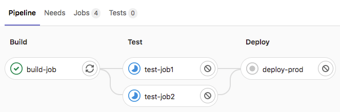

介紹如何透過 GitLab API 在 Upstream 取得 Downstream 的 artifact。

大家都熟悉在 repo 裏面建立自己的 GitLab CI/CD，一個 repo 每次產生一組 pipeline 裏面帶有多個 jobs，如下圖：



那如果需要在 A repo 的 pipeline 通知 repo B 一起進行編譯，並把 repo B 的 artifact 放進 A repo 的 artifact 時，我們能怎麽做？

option 1: 把 repo B 加入 repo A 的 sub module 一起編譯

option 2: 利用 GitLab 的 multiple-project pipeline 機制觸發另一個 pipeline

本篇將介紹 option 2 的 multiple-project pipeline 機制。


# 基本介紹 multiple-project pipeline

GitLab CI/CD 支援跨 project 的特性，由一個 pipeline 觸發另一個 pipeline。

觸發者被稱爲 upstream，接受被觸發的稱爲 downstream (它可以多個)。

如何觸發另一個 repo 的 pipeline 呢？
```
stages:
  - trigger_repob
  - buildTrigger-Repo-B:
 
stage: trigger_repob
  variables:
    ENVIRONMENT: staging
  trigger: 
    project: my_group/repoB
    branc: dev
    strategy: dependBuild-Repo-A:
  stage: build
  script:
    - echo "upstream"
```
關鍵字：**trigger**，它可指定變數從到 downstream，或是要觸發的 project 與 branch，以及是否要等待 pipeline 執行狀態再接著往下。

trigger 下可以用的 keywords 可以參考 Trigger job configuration keywords。

觸發其他 project 的 pipeline 的畫面如下，可以看到 Downstream 可有多個，而且各自 Downstream 的 pipeline 可同時進行：


更多詳細的介紹請參考 Multiple-project pipelines。

取得 Downstream 的 artifact

熟悉 Multiple-project pipelines 後，接下來是重點，我怎麽能從 upstream 取得 downstream 裏面 Job 的 artifact 呢？

從 GitLab issues 可以找到很多人許願這樣的功能：[Allow job in upstream pipeline to reference artifacts from a downstream pipeline](https://gitlab.com/gitlab-org/gitlab/-/issues/285100)，但目前還沒有被支援，不過這篇裏面有人介紹了 workaround 做法，我們來看看吧。

以下 GitLab API 是我們下手的機會：

[List pipeline bridges](https://docs.gitlab.com/ee/api/jobs.html#list-pipeline-trigger-jobs)：取得 upstream 下擁有的 downstream pipeline
[List pipeline jobs](https://docs.gitlab.com/ee/api/jobs.html#list-pipeline-jobs)：取得 pipeline 的 jobs
[Get job artifacts](https://docs.gitlab.com/ee/api/job_artifacts.html#get-job-artifacts)：取得 job 的 artifacts

API 的使用流程(記得要申請 GitLab API Token)如下：


使用 API 的流程，我不建議寫在 .gitlab-ci.yml，因爲非常難 debug，因此，如果您是熟悉 shell 或 powershell 的人可以直接包裝成執行檔來進行。

以下是我用 powershell 寫的範例(rebuild.ps1: 假設 repoB 有一個 job: build-repo 是我想要的 artifact)：
```
# use Bridge API to get downstream project id
$BRIDGE_API = "$CI_API/$PROJECT_ID/pipelines/$PIPELINE_ID/bridges"
$response = Invoke-RestMethod -URI $BRIDGE_API -HEADERS @{'PRIVATE-TKEN' = $TOKEN }
$downstream_project_id = $response.downstream_pipleline.project_id

# use Job API to get job content by downstream pipeline id
$JOB_API = "$CI_API/$downstream_project_id/pipelines/jobs"
$response = Invoke-RestMethod -URI $JOB_API -HEADERS @{'PRIVATE-TKEN' = $TOKEN }

# find target job to get id and artifact
$job_id = ""
$artifact = ""foreach ($job in $response) {
  if ($job.name -eq "build-repo") {
     $artifact = $job.artifacts_file
     $job_id = $job.id  }
}

# download artifact
$ARTIFACTS_API = "$CI_API/$downstream_project_id/jobs/$job_id/artifacts"
Invoke-RestMethod -URI $ARTIFACTS_API -HEADERS @{'PRIVATE-TKEN' = $TOKEN } -OutFile "./$($artifact.filename)"
```
最終合并到 .gitlab-ci.yml 的内容如下：
```
stages:
  - build
  - deploybuild-sharecode:
  
stage: build
  trigger:
    project: poulin/shopping-radar-sharecode
    branch: master
    strategy: depend
    
deploy-linbot:
  stage: delpoy
  script:
    - echo "start build"
    - powershell "./rebuild.ps1" "$CI_API_V4_URL/projects" $CI_PROJECT_ID $CI_PIPELINE_ID $env:GITLAB_TOKEN
    - cp ./sharecode ./bin
  needs:
    - build-sharecode
  only:
    - master
  tags:
    - windows

做法確實很 workaround，但很實用。上面的範例是針對 downstream 下的其中一個 job，如果您有多個 job 的 artifacts 要存取也可以修改裏面的程式碼進行使用哦。
```

# References

- [List pipeline bridges](https://gitlab.com/gitlab-org/gitlab/-/issues/285100)
- [Get job artifacts](https://docs.gitlab.com/ee/api/job_artifacts.html#get-job-artifacts)